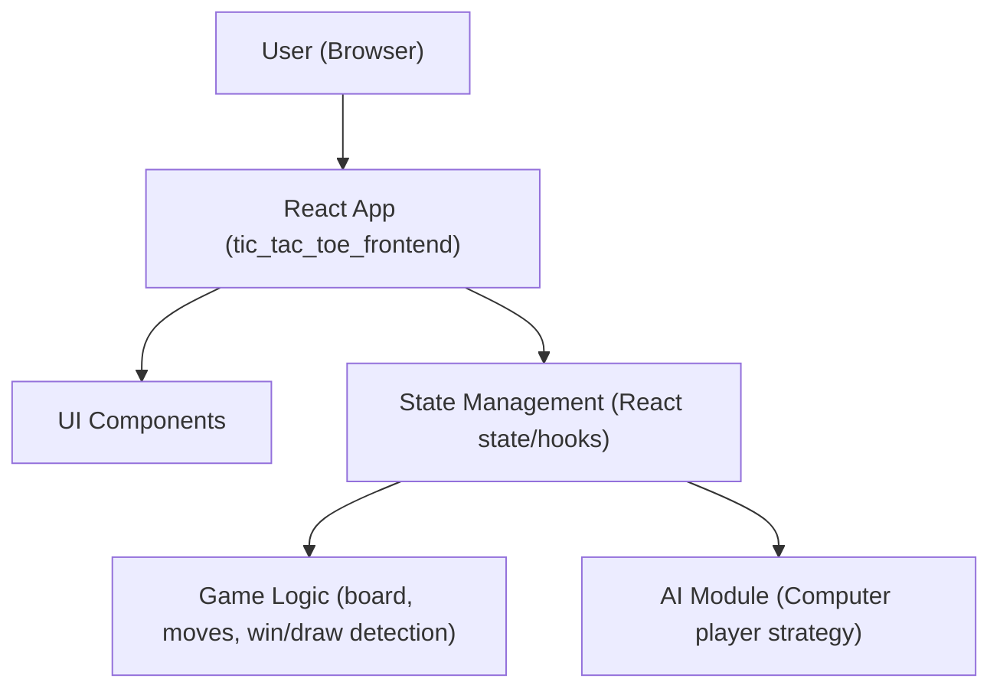

# Architecture — Tic Tac Toe Web App (React Frontend)

## High-Level Architecture
The application is a single React frontend with no backend. All game state and logic reside client-side in React components and hooks. The UI presents a centered 3x3 board, a control bar for starting and selecting modes, and a status area for turn and result messages. Styling follows the Ocean Professional theme.

### Conceptual Diagram

## Component Breakdown
- App: Top-level shell that organizes layout and theme, renders control bar, board, and status.
- Controls: Mode selection (Player vs Player / Player vs Computer), Start New Game and Reset buttons.
- Board: Renders 3x3 grid; delegates clicks to the game logic; highlights winning line if desired.
- Square (Cell): Simple presentational component showing X, O, or empty state.
- Status: Displays current player turn and final outcome (X wins, O wins, Draw).
- ThemeProvider/Theme Tokens: Supplies Ocean Professional colors and shared styles to components.

## State Management Approach
- useState/useReducer for local game state:
  - board: string[9] | null entries for cells.
  - currentPlayer: 'X' | 'O'.
  - mode: 'PVP' | 'PVC'.
  - gameStatus: 'IN_PROGRESS' | 'X_WINS' | 'O_WINS' | 'DRAW'.
- Derived selectors/utilities compute:
  - next player
  - available moves
  - winner or draw

State changes are triggered by user clicks (human moves), AI turns (when mode is PVC and it is O’s or X’s turn depending on implementation), and reset actions.

## Game Logic Overview
- Move Handling:
  - Ignore clicks on occupied squares or after a game has ended.
  - Place current mark, then evaluate win/draw.
  - If in-progress and mode is PVC and it is the computer’s turn, schedule AI move.
- Win/Draw Detection:
  - Evaluate all 8 winning line combinations after every move.
  - Draw occurs when board has no empty cells and there is no winner.

## AI Strategy (Computer Player)
- Strategy: Simple, deterministic, and fast.
  - Check for immediate winning move; if available, take it.
  - Otherwise, block opponent’s immediate win if present.
  - Otherwise, take center if available.
  - Otherwise, take a corner if available.
  - Otherwise, take any available move.
- This approach balances predictability and responsiveness without heavy computation.

## Routing
- No routing is required for the MVP. The app renders a single view.
- Future: Add simple routes if additional pages are introduced, e.g., /, /settings, /about.

## Styling and Theming
- Theme: Ocean Professional
  - primary: #2563EB
  - secondary: #F59E0B
  - success: #F59E0B
  - error: #EF4444
  - gradient: from-blue-500/10 to-gray-50
  - background: #f9fafb
  - surface: #ffffff
  - text: #111827
- Style Principles:
  - Modern, minimalist design with subtle shadows and rounded corners.
  - Smooth transitions on hover/focus and board interactions.
  - High contrast for text and key interactive elements.
- Implementation:
  - Either plain CSS, CSS Modules, or a CSS-in-JS solution can be used; keep tokens centralized for consistency.
  - Use CSS variables or a theme object to distribute color tokens and spacing across components.

## Error Handling
- Prevent invalid moves (clicks on occupied cells) by early returns in handlers.
- Guard against moves after game end; provide clear status.
- Wrap AI move scheduling in try/catch; fail silently to no-op if errors occur and keep the UI stable.
- Display a non-intrusive error toast or status text if a critical error is detected.

## Accessibility
- Keyboard navigation: Cells reachable via Tab; Enter/Space triggers a move if valid.
- ARIA labels: Announce cell coordinates and current value; live region for status updates (e.g., “X’s turn”, “X wins”, “Draw”).
- Color contrast: Ensure WCAG AA for text and interactive elements using theme tokens.
- Focus states: Visible and distinct focus ring on interactive elements.

## Performance Considerations
- Keep renders minimal by memoizing Square components where possible.
- Use a simple reducer/state structure to avoid unnecessary re-renders.
- AI logic should execute synchronously and quickly; if async, debounce to avoid flicker.

## Future Extensibility
- Backend Integration: A backend could be added for online multiplayer, persistence, or analytics. Suggested integration points:
  - Abstract move dispatch and state synchronization (e.g., via WebSocket).
  - Introduce a service layer for network operations.
- Routing: Add routes for modes/settings without disrupting the core game.
- Skins/Themes: Extend theme tokens for dark mode or alternate color schemes.
- AI Upgrades: Swap the AI module with minimax or heuristic-based strategies.
- Internationalization: Add i18n with message catalogs and locale switcher.

## Environment and Dev Notes
- Container: Single React frontend (tic_tac_toe_frontend).
- Port: 3000 for local dev server (typical for React).
- Environment Variables: None required; .env is empty.
- Preview: Managed by the user; do not attempt to start/stop within documentation.
- Repository Notes: Current README is minimal; add developer setup steps alongside this documentation as needed.
